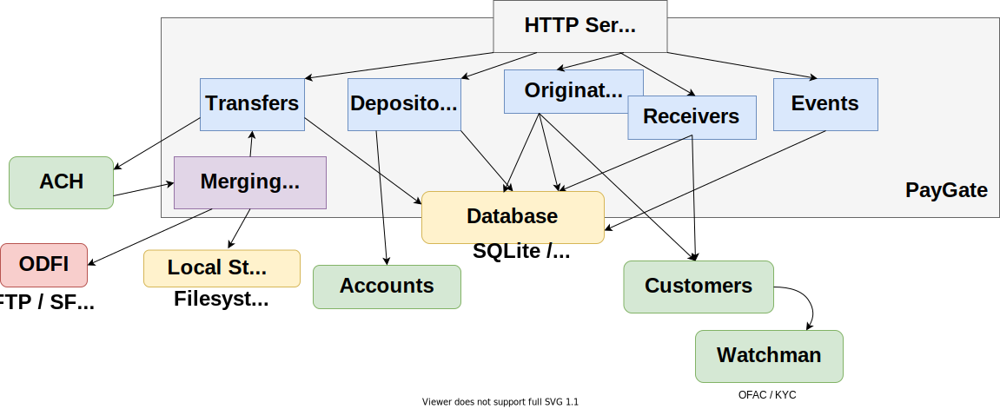

moov-io/paygate
===

[](https://godoc.org/github.com/moov-io/paygate)
[](https://travis-ci.com/moov-io/paygate)
[](https://codecov.io/gh/moov-io/paygate)
[](https://goreportcard.com/report/github.com/moov-io/paygate)
[](https://raw.githubusercontent.com/moov-io/paygate/master/LICENSE)

Moov Paygate is a RESTful API enabling Automated Clearing House ([ACH](https://en.wikipedia.org/wiki/Automated_Clearing_House)) transactions to be submitted and received without a deep understanding of a full NACHA file specification.

Docs: [docs.moov.io](https://docs.moov.io/paygate/) | [api docs](https://api.moov.io/apps/paygate/)

## Project Status

This project is currently under development and could introduce breaking changes to reach a stable status. We are looking for community feedback so please try out our code or give us feedback!

## Getting Started

Paygate can be ran or deployed in various ways. We have several guides for running paygate and offer a testing utility called [`apitest` from the moov-io/api repository](https://github.com/moov-io/api#apitest) for verifying paygate (and its dependnecies) are running properly.

- [Using docker-compose](#local-development)
- [Using our Docker image](#docker-image)
- [Build from source](#build-from-source)
- [How to setup open source ACH payments using Moov.io suite](https://medium.com/@tgunnoe/how-to-setup-open-source-ach-payments-using-moov-io-suite-3586757e45d6) by Taylor Gunnoe
  - Taylor has also written [paygate-cli](https://github.com/tgunnoe/paygate-cli) which is a command-line interface to paygate.

### Vocab

<dl>
    <dt>CIP</dt><dd>Customer Identification Program -- Verification process of customer information including KYC and social security number</dd>
    <dt>customerID</dt><dd>Unique ID from the <a href="https://github.com/moov-io/customers">Moov Customers</a> service. KYC and CIP checks utilize this to associate with paygate objects.</dd>
    <dt>KYC</dt><dd>Know Your Customer -- Verification process of customer information including: name, date of birth and address</dd>
    <dt>Originator</dt><dd>Entity that initiates the ACH transfer. Often usecases have one Originator to make all transfers from.</dd>
    <dt>Receiver</dt><dd>Entity that is the target of an ACH transfer.</dd>
    <dt>userID</dt><dd>Unique ID used to organize and isolate objects created within paygate. Objects are not accessible across userIDs</dd>
</dl>

## Deployment

Paygate currently requires the [FED](https://github.com/moov-io/fed) service to be deployed and available via `FED_ENDPOINT`.

- The `X-User-Id` (case insensntive) HTTP header is also required and we recommend using an auth proxy to set this. Paygate only expects this value to be unique and consistent to a user.

The following services are required by default, but can be disabled:

- [Accounts](https://github.com/moov-io/accounts) (HTTP server) via `ACCOUNTS_ENDPOINT` and disabled with `ACCOUNTS_CALLS_DISABLED=yes`
- [Customers](https://github.com/moov-io/customers) (HTTP server) via `CUSTOMERS_ENDPOINT` and disabled with `CUSTOMERS_CALLS_DISABLED=yes`

### Docker image

You can download [our docker image `moov/paygate`](https://hub.docker.com/r/moov/paygate/) from Docker Hub or use this repository. No configuration is required to serve on `:8082` and metrics at `:9092/metrics` in Prometheus format.


```
$ docker run -p 8082:8082 moov/paygate:latest
ts=2018-12-13T19:18:11.970293Z caller=main.go:55 startup="Starting paygate server version v0.5.1"
ts=2018-12-13T19:18:11.970391Z caller=main.go:59 main="sqlite version 3.25.2"
ts=2018-12-13T19:18:11.971777Z caller=database.go:88 sqlite="starting database migrations"
ts=2018-12-13T19:18:11.971886Z caller=database.go:97 sqlite="migration #0 [create table if not exists receivers(cus...] changed 0 rows"
... (more database migration log lines)
ts=2018-12-13T19:18:11.97221Z caller=database.go:100 sqlite="finished migrations"
ts=2018-12-13T19:18:11.975093Z caller=main.go:155 transport=HTTP addr=:8082
ts=2018-12-13T19:18:11.975177Z caller=main.go:124 admin="listening on :9092"

$ curl -XPOST -H "x-user-id: test" localhost:8082/originators --data '{...}'
```

### Local development

We support a [Docker Compose](https://docs.docker.com/compose/gettingstarted/) environment in paygate that can be used to launch the entire Moov stack. After setup launching the stack is the following steps and we offer a testing utility [`apitest` from the moov-io/api repository](https://github.com/moov-io/api#apitest).

Using the [latest released `docker-compose.yml`](https://github.com/moov-io/paygate/releases/latest) is recommended as that will use released versions of dependencies.

```
$ docker-compose up -d
paygate_ofac_1 is up-to-date
Recreating paygate_accounts_1 ...
paygate_fed_1 is up-to-date
Recreating paygate_accounts_1 ... done
Recreating paygate_paygate_1  ... done

# Run Moov's testing utility
$ apitest -local
2019/06/10 21:18:06.117261 main.go:61: Starting apitest v0.9.5
2019/06/10 21:18:06.117293 main.go:133: Using http://localhost as base API address
...
2019/06/10 21:18:06.276443 main.go:218: SUCCESS: Created user b1f2671bbed52ed6da88f16ce467cadecb0ee1b6 (email: festive.curran27@example.com)
...
2019/06/10 21:18:06.607817 main.go:218: SUCCESS: Created USD 204.71 transfer (id=b7ecb109574187ff726ba48275dcf88956c26841) for user
```

### Build from source

PayGate orchestrates several services that depend on Docker and additional GoLang libraries to run. Paygate leverages [Go Modules](https://github.com/golang/go/wiki/Modules) to manage dependencies. Ensure that your build environment is running Go 1.14 or greater. PayGate depends on other Docker containers that will be downloaded for testing and running the service. Ensure [Docker](https://docs.docker.com/get-started/) is installed and running.

```
$ cd moov/paygate # wherever this project lives

$ go run .
ts=2018-12-13T19:18:11.970293Z caller=main.go:55 startup="Starting paygate server version v0.5.1"
ts=2018-12-13T19:18:11.970391Z caller=main.go:59 main="sqlite version 3.25.2"
ts=2018-12-13T19:18:11.971777Z caller=database.go:88 sqlite="starting database migrations"
ts=2018-12-13T19:18:11.971886Z caller=database.go:97 sqlite="migration #0 [create table if not exists receivers(cus...] changed 0 rows"
... (more database migration log lines)
ts=2018-12-13T19:18:11.97221Z caller=database.go:100 sqlite="finished migrations"
ts=2018-12-13T19:18:11.975093Z caller=main.go:155 transport=HTTP addr=:8082
ts=2018-12-13T19:18:11.975177Z caller=main.go:124 admin="listening on :9092"
```

### Architecture

This is an overall diagram of PayGate and its dependencies.



**Note**: Arrows show connection initiation direction, not entirely dataflow direction.

### Configuration

The following environmental variables can be set to configure behavior in paygate.

| Environmental Variable | Description | Default |
|-----|-----|-----|
| `ACCOUNTS_ENDPOINT` | A DNS record responsible for routing us to an [Accounts](https://github.com/moov-io/accounts) instance. | `http://accounts.apps.svc.cluster.local:8080` |
| `ACCOUNTS_CALLS_DISABLED=yes` | Flag to completely disable all calls to an Accounts service. This is used when paygate doesn't need to integrate with a general ledger solution. | `no` |
| `CUSTOMERS_ENDPOINT` | A DNS record responsible for routing us to a [Customers](https://github.com/moov-io/customers) instance. | `http://customers.apps.svc.cluster.local:8080` |
| `CUSTOMERS_CALLS_DISABLED=yes` | Flag to completely disable all calls to a Customers service. This is used when paygate doesn't need to integrate with a KYC/CIP solution. | `no` |
| `FED_ENDPOINT` | HTTP address for [FED](https://github.com/moov-io/fed) interaction to lookup ABA routing numbers. | `http://fed.apps.svc.cluster.local:8080` |
| `FED_CALLS_DISABLED=yes` | Flag to completely disable all calls to Fed service. This is used by paygate to verify routing numbers. | `no` |
| `HTTP_ADMIN_BIND_ADDRESS` | Address for paygate to bind its admin HTTP server on. This overrides the command-line flag `-admin.addr`. | `:9092` |
| `HTTP_BIND_ADDRESS` | Address for paygate to bind its HTTP server on. This overrides the command-line flag `-http.addr`. | `:8082` |
| `HTTP_CLIENT_CAFILE` | Filepath for additional (CA) certificates to be added into each `http.Client` used within paygate. | Empty |
| `HTTPS_CERT_FILE` | Filepath containing a certificate (or intermediate chain) to be served by the HTTP server. Requires all traffic be over secure HTTP. | Empty |
| `HTTPS_KEY_FILE`  | Filepath of a private key matching the leaf certificate from `HTTPS_CERT_FILE`. | Empty |
| `REMOTE_ADDRESS_HEADER` | HTTP header name to discover remote address. Takes first IP from comma-separated list. | `X-Real-Ip` |
| `LOG_FORMAT` | Format for logging lines to be written as. (Options: `json`, `plain`) | `plain` |
| `DATABASE_TYPE` | Which database option to use - See **Storage** header below for per-database configuration (Options: `sqlite`, `mysql`) | `sqlite` |
| `CONFIG_FILE` | File path if given will load configs from a Yaml file instead of a database. | Empty |
| `CLOUD_PROVIDER` | Provider name which determines which of the following environmental variables are used to initialize Customer's persistence. | Empty |

#### ACH File Uploading

| Environmental Variable | Description | Default |
|-----|-----|-----|
| `ACH_FILE_BATCH_SIZE` | Number of Transfers to retrieve from the database in each batch for mergin before upload to Fed. | 100 |
| `ACH_FILE_MAX_LINES` | Maximum line count before an ACH file is uploaded to its remote server. NACHA guidelines have a hard limit of 10,000 lines. | 10000 |
| `ACH_FILE_TRANSFERS_CAFILE` | Filepath for additional (CA) certificates to be added into each FTP client used within paygate. | Empty |
| `ACH_FILE_TRANSFER_INTERVAL` | Go duration for how often to check and sync ACH files on their SFTP destinations. (Set to `off` to disable.) | `10m` |
| `ACH_FILE_STORAGE_DIR` | Filepath for storage of ACH files. This is used as a location to manage merging, outbound, and incoming/returned ACH files. | `./storage/` |
| `FORCED_CUTOFF_UPLOAD_DELTA` | Go duration for when the current time is within the routing number's cutoff time by duration force that file to be uploaded. | `5m` |

See [our detailed documentation for FTP and SFTP configurations](https://docs.moov.io/paygate/ach/#uploads-of-merged-ach-files).

#### Transfers

| Environmental Variable | Description | Default |
|-----|-----|-----|
| `TRANSFERS_ONE_DAY_USER_LIMIT` | Maximum sum of transfers for each user over the current day. | `5000.00` |
| `TRANSFERS_SEVEN_DAY_USER_LIMIT` | Maximum sum of transfers for each user over the previous seven days. | `10000.00` |
| `TRANSFERS_THIRTY_DAY_USER_LIMIT` | Maximum sum of transfers for each user over the previous seven days. | `25000.00` |

#### Inbound / Returned File Processing

| Environmental Variable | Description | Default |
|-----|-----|-----|
| `UPDATE_DEPOSITORIES_FROM_CHANGE_CODE=yes` | `Depository` objects will be updated from COR/NOC addendas from rejected files. | `no` |

##### FTP Configuration

Our FTP client offers some configuration options. Paygate currently uses the [jlaffaye/ftp](https://github.com/jlaffaye/ftp) library.

| Environmental Variable | Description | Default |
|-----|-----|-----|
| `FTP_DIAL_TIMEOUT` | Go duration for timeout when creating FTP connections. | `10s` |
| `FTP_DIAL_WITH_DISABLED_ESPV` | Offer EPSV to be used if the FTP server supports it. | `false` |

##### SFTP Configuration

Our SFTP (SSH File Transfer Protocol) client offers some configuration options. Paygate currently uses the [pkg/sftp](https://github.com/pkg/sftp) library.

| Environmental Variable | Description | Default |
|-----|-----|-----|
| `SFTP_DIAL_TIMEOUT` | Go duration for timeout when creating SFTP connections. | `10s` |
| `SFTP_MAX_CONNS_PER_FILE` | Sets the maximum concurrent requests allowed for a single file. | 8 |
| `SFTP_MAX_PACKET_SIZE` | Sets the maximum size of the payload, measured in bytes. Try lowering this on "failed to send packet header: EOF" errors. | 20480 |

Note: By default paygate **does not verify** the SFTP host public key. Write the expected public key into `sftp_configs`'s `host_public_key` column to have paygate verify.

#### Depository Verification

In order to validate `Depository` objects and transfer money PayGate needs to verify the user is authorized to access the `Depository`. This typically involves micro-deposits (sending two debits under $1 to the account and having the user confirm these amounts) followed by a credit from the account to balance the accounting.

##### Micro Deposits

PayGate submits small deposits, credits the balance and has the user confirm the amounts manually. This is only required once per `Depository`. To setup the funding account for these deposits the following configuration options for paygate are below and are all required:

| Environmental Variable | Description | Default |
|-----|-----|-----|
| `ODFI_ACCOUNT_NUMBER` | Account Number of Financial Institution which is originating micro deposits. | 123 |
| `ODFI_ACCOUNT_TYPE` | Type of ODFI account used for micro-depsits (Checking or Savings) | Savings |
| `ODFI_BANK_NAME` | Legal name of Financial Institution which is originating micro deposits. | Moov, Inc |
| `ODFI_HOLDER` | Legal name of Financial Institution which is originating micro deposits. | Moov, Inc |
| `ODFI_IDENTIFICATION` | Number by which the customer is known to the Financial Institution originating micro deposits. | 001 |
| `ODFI_ROUTING_NUMBER` | ABA routing number of Financial Institution which is originating micro deposits. | 121042882 |

#### Account Number Encryption

The following environment variables control which backend service is initialized for account number encryption. They are stored and encrypted with [GoCloud CDK](https://gocloud.dev/howto/secrets/)'s Secrets. ([godoc](https://godoc.org/gocloud.dev/secrets))

##### Local storage

| Environmental Variable | Description | Default |
|-----|-----|-----|
| `SECRETS_LOCAL_BASE64_KEY` | A base64 encoded key used to encrypt and decrypt secrets in memory. This value needs to look like `base64key://value` where `value` is a 32 byte random key. | Empty

##### Google Cloud Storage

| Environmental Variable | Description | Default |
|-----|-----|-----|
| `SECRETS_GCP_KEY_RESOURCE_ID` | A Google Cloud resource ID used to interact with their Key Management Service (KMS). This value has the form `projects/MYPROJECT/locations/MYLOCATION/keyRings/MYKEYRING/cryptoKeys/MYKEY` and [their documentation has more details](https://cloud.google.com/kms/docs/object-hierarchy#key). | Empty |

##### Vault storage

| Environmental Variable | Description | Default |
|-----|-----|-----|
| `VAULT_SERVER_TOKEN` | A Vault generated value used to authenticate. See [the Hashicorp Vault documentation](https://www.vaultproject.io/docs/concepts/tokens.html) for more details. | Empty |
| `VAULT_SERVER_URL` | A URL for accessing the vault instance. In production environments this should be an HTTPS (TLS) secured connection. | Empty |

#### Storage

Based on `DATABASE_TYPE` the following environment variables will be read to configure connections for a specific database.

##### MySQL

| Environmental Variable | Description | Default |
|-----|-----|-----|
| `MYSQL_ADDRESS` | TCP address for connecting to the mysql server. (Example `tcp(hostname:3306)`) | Empty |
| `MYSQL_DATABASE` | Name of database to connect into. | Empty |
| `MYSQL_PASSWORD` | Password of user account for authentication. | Empty |
| `MYSQL_USER` | Username used for authentication. | Empty |
| `MYSQL_MAX_CONNECTIONS` | Max active connections to MySQL instance. | 16 |

Refer to the mysql driver documentation for [connection parameters](https://github.com/go-sql-driver/mysql#dsn-data-source-name).

##### SQLite

| Environmental Variable | Description | Default |
|-----|-----|-----|
| `SQLITE_DB_PATH` | Local filepath location for the paygate SQLite database. | `paygate.db` |

Refer to the sqlite driver documentation for [connection parameters](https://github.com/mattn/go-sqlite3#connection-string).

#### Customers

Below is the configuration options for Customers (KYC, AML, OFAC) validation.

##### OFAC Refreshing

| Environmental Variable | Description | Default |
|-----|-----|-----|
| `CUSTOMERS_OFAC_BATCH_SIZE` | How many Originator and Receiver Customers to pull for refreshing. | `100` |
| `CUSTOMERS_OFAC_REFRESH_EVERY` | Interval for how often to refresh Customer OFAC searches | `168h` |

## Getting Help

 channel | info
 ------- | -------
 [Project Documentation](https://docs.moov.io/) | Our project documentation available online.
 Google Group [moov-users](https://groups.google.com/forum/#!forum/moov-users)| The Moov users Google group is for contributors other people contributing to the Moov project. You can join them without a google account by sending an email to [moov-users+subscribe@googlegroups.com](mailto:moov-users+subscribe@googlegroups.com). After receiving the join-request message, you can simply reply to that to confirm the subscription.
Twitter [@moov_io](https://twitter.com/moov_io)	| You can follow Moov.IO's Twitter feed to get updates on our project(s). You can also tweet us questions or just share blogs or stories.
[GitHub Issue](https://github.com/moov-io) | If you are able to reproduce a problem please open a GitHub Issue under the specific project that caused the error.
[moov-io slack](https://slack.moov.io/) | Join our slack channel to have an interactive discussion about the development of the project.

## Supported and Tested Platforms

- 64-bit Linux (Ubuntu, Debian), macOS, and Windows

## Contributing

Yes please! Please review our [Contributing guide](CONTRIBUTING.md) and [Code of Conduct](https://github.com/moov-io/ach/blob/master/CODE_OF_CONDUCT.md) to get started! Checkout our [issues for first time contributors](https://github.com/moov-io/paygate/contribute) for something to help out with.

Paygate includes several "long" tests which spawn Docker containers, make requests over the internet, and perform more complicated tests. To skip these long tests add the `-short` flag to `go test`.

This project uses [Go Modules](https://github.com/golang/go/wiki/Modules) and uses Go 1.14 or higher. See [Golang's install instructions](https://golang.org/doc/install) for help setting up Go. You can download the source code and we offer [tagged and released versions](https://github.com/moov-io/paygate/releases/latest) as well. We highly recommend you use a tagged release for production.

### Test Coverage

Improving test coverage is a good candidate for new contributors while also allowing the project to move more quickly by reducing regressions issues that might not be caught before a release is pushed out to our users. One great way to improve coverage is by adding edge cases and different inputs to functions (or [contributing and running fuzzers](https://github.com/dvyukov/go-fuzz)).

Tests can run processes (like sqlite databases), but should only do so locally.

Each PR should increase the overall coverage, if possible. You can run `make cover-test` to save a coverage profile and `make cover-web` to open the HTML view in your default browser.

## License

Apache License 2.0 See [LICENSE](LICENSE) for details.
